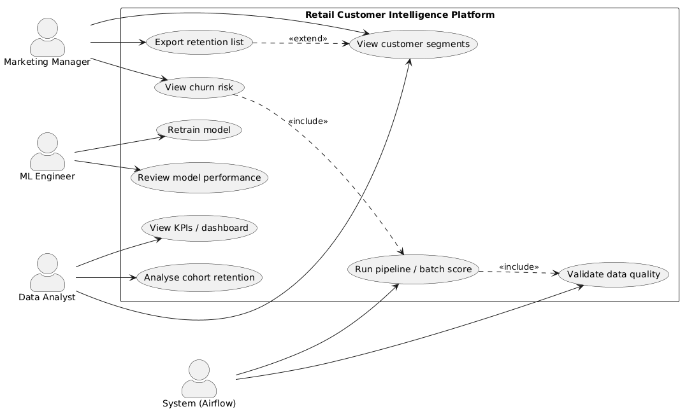
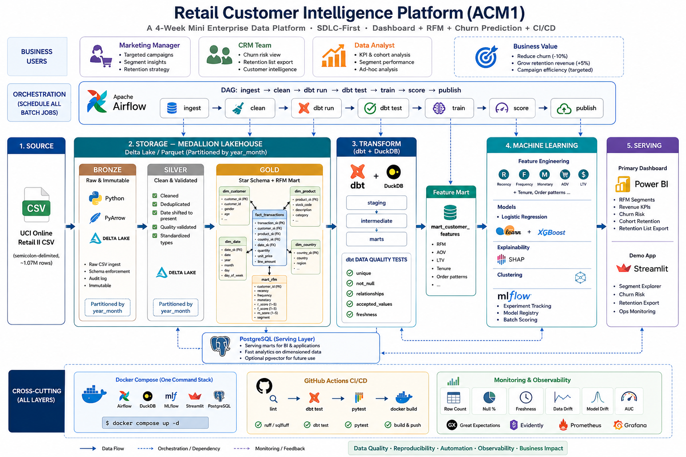
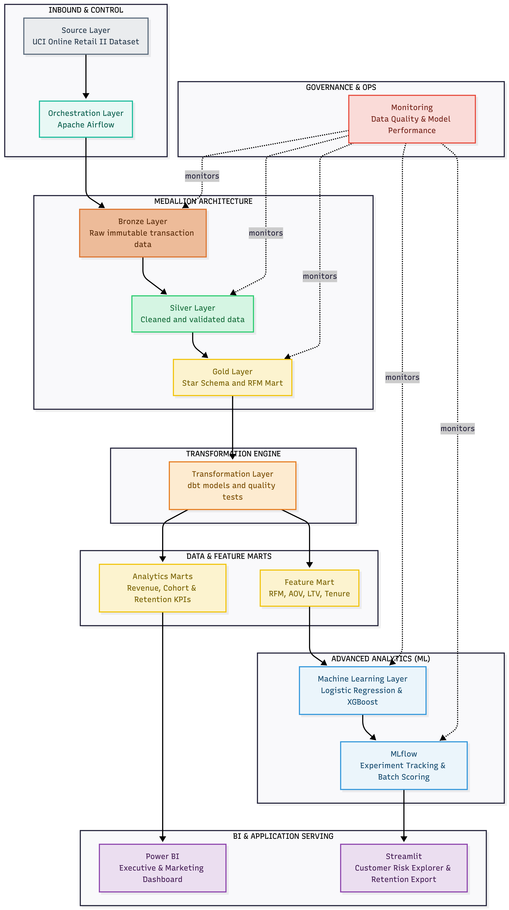
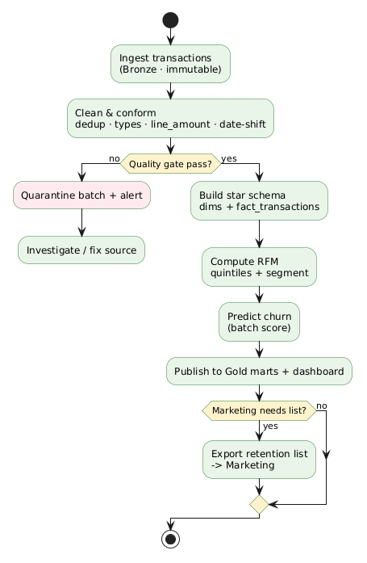
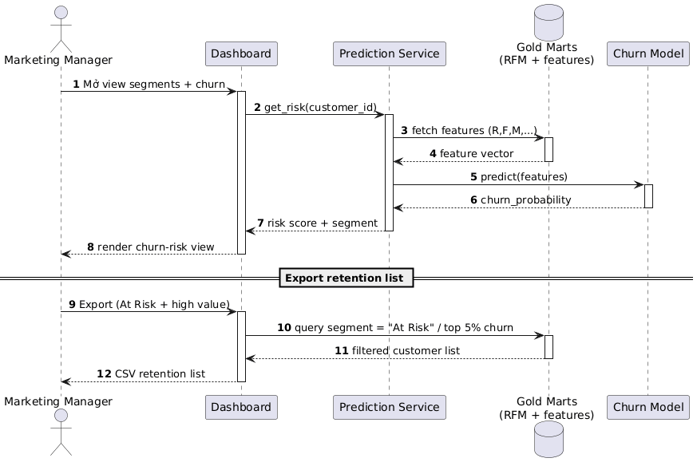
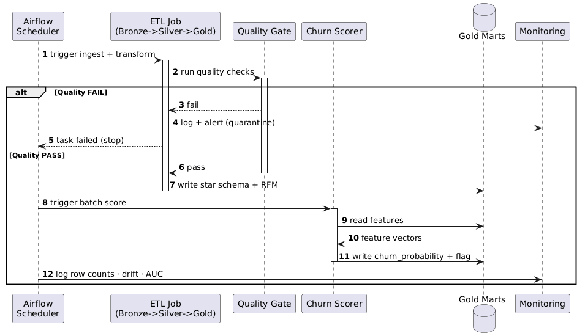

# Business Requirements Document & Solution Architecture
## Retail Customer Intelligence Platform

> *Mini Enterprise Data Platform — turning raw e-commerce transactions into customer segments, churn predictions, and an exportable retention list.*

| | |
|---|---|
| **Project** | Retail Customer Intelligence Platform |
| **Programme** | AIO Conquer 2026 · Module 01 · Project #22 + #20 |
| **Document** | BRD + Solution Architecture (combined) |
| **Version** | 1.1 |
| **Status** | Approved for build |
| **Author / Owner** | Phan Văn Tiến (Tech Lead) |
| **Prepared** | 02 June 2026 |
| **Last updated** | 10 June 2026 |
| **Jira board** | [`ACM1`](https://vongocgiabao79.atlassian.net/jira/software/projects/ACM1) |

---

## 0. Document Purpose

This document defines **why** the project exists before **how** it is built. Part A (§1–§9) captures the business problem, measurable objectives, stakeholders, scope, and requirements. Part B (§10–§13) captures the solution architecture, data model, and UML design that realise those requirements. It is the single source of truth that downstream artefacts — pipeline, tests, and the final business-impact report — are traced back to.

**Guiding principle — SDLC over model.** What makes this project "enterprise" is the discipline of the full lifecycle (requirements → design → data modelling → build → testing → CI/CD → impact), not the sophistication of the churn model. The predictive model represents only ~15–20% of total project value.

---

# Part A — Business Requirements

## 1. Business Context & Problem Statement

The business runs an online retail operation with a large base of historical transactions but **no systematic way to understand or act on customer behaviour**. Marketing and retention activities are currently undifferentiated.

### 1.1 Pain Points

| # | Pain point | Business consequence |
|---|---|---|
| P1 | Marketing sends **mass campaigns** to the entire customer base | Low relevance, wasted marketing spend, message fatigue |
| P2 | **Retention is low**; high-value customers churn unnoticed | Lost recurring revenue from the most profitable customers |
| P3 | **No systematic way to identify** which customers are about to leave | Reactive (not proactive) retention; intervention happens too late |

### 1.2 Root Cause

Customer data exists only as raw transaction records. There is no cleaned, modelled, and segmented view of customers — and no risk score — so the business cannot target, prioritise, or measure retention efforts.

---

## 2. Business Objectives & Success Metrics

The platform must enable measurable improvements in retention and campaign efficiency.

| Goal | Target | Metric | Owner |
|---|---|---|---|
| Reduce churn | **−10%** | Churn rate (rolling 90-day) | Marketing |
| Grow retention revenue | **+5%** | Revenue from returning customers | Marketing |
| Improve campaign efficiency | Targeted, not mass | % of campaigns sent to defined segments | Marketing |

> These are **business outcome targets** the platform is designed to support. The platform's own delivery success is defined separately in §7 (Acceptance Criteria).

---

## 3. Stakeholders

| Stakeholder | Role / Interest | Primary need from the platform |
|---|---|---|
| **Marketing Manager** | Owns campaigns & retention | Targeted retention lists, clear segment definitions, exportable lists |
| **CRM Team** | Executes customer engagement | Customer-level churn risk, an export workflow they can action |
| **Data Team** | Builds & operates the platform | Reliable pipeline, monitored model performance, data quality visibility |
| **Project Sponsor / Reviewer** | Evaluates delivery | Evidence of SDLC maturity and measurable business impact |

---

## 4. Scope

### 4.1 In Scope

The end-to-end flow:

```
Historical transactions → Cleaned & modelled data → RFM segments
→ Churn predictions → Retention-list export + Dashboard
```

1. **Ingest & clean** historical e-commerce transactions into a governed, layered data store.
2. **Model** the data into a dimensional (star) schema with measures and conformed dimensions.
3. **Compute RFM** (Recency, Frequency, Monetary) scores and assign business segment labels (Champions, Loyal, At Risk, Lost, …).
4. **Predict churn risk** at the customer level (batch scoring).
5. **Serve** segments, KPIs, churn-risk, and cohort views through a dashboard.
6. **Export** a retention list (e.g. At-Risk + high-value customers) for Marketing.
7. **Monitor** data quality and model performance.

### 4.2 Out of Scope

The following are explicitly **excluded** from this delivery (simulated or documented only):

- Live campaign execution.
- Email / SMS sending.
- Real CRM-system integration (interaction is simulated via list export).
- Real-time / streaming scoring (a streaming replay is a documented future option only).
- Cloud production deployment (a target architecture is documented; the build is local/containerised).

### 4.3 Assumptions

- The source is a single historical transaction dataset ("Online Retail Listing", ~1.05M rows, Kaggle), provided as `online_retail_listing.csv`.
- Source timestamps are historical (2009–2011) and are **date-rebased to the present** so that recency and churn windows remain meaningful for demonstration.
- One currency (GBP); monetary values are reported in GBP.
- Customer identity is the source-provided `Customer ID`; transactions without a customer ID are treated as guest/anonymous and excluded from customer-level analytics.

### 4.4 Constraints

- **Timeline:** 4-week delivery window (4 sprints).
- **Team:** 5 members (see §14).
- **Technology discipline:** deliberately **no Kafka / Spark / Kubernetes / microservices** — maturity is demonstrated through SDLC completeness, not framework count.
- **Reproducibility:** the stack must run locally with a single command for reviewer reproducibility.

---

## 5. Functional Requirements

| ID | Requirement | Priority | Traces to |
|---|---|---|---|
| FR-1 | The system shall ingest raw transaction records into an immutable raw layer. | MUST | P2, P3 |
| FR-2 | The system shall clean, deduplicate, type-cast, and validate transactions, and quarantine batches that fail quality checks. | MUST | P2 |
| FR-3 | The system shall rebase historical transaction dates to the present so recency/churn windows are meaningful. | MUST | P3 |
| FR-4 | The system shall model transactions into a star schema (`fact_transactions` + `dim_customer`, `dim_product`, `dim_date`, `dim_country`). | MUST | P1 |
| FR-5 | The system shall compute per-customer RFM scores (1–5 quintiles) and assign a segment label. | MUST | P1 |
| FR-6 | The system shall produce a per-customer churn probability and a threshold-based churn flag. | SHOULD | P2, P3 |
| FR-7 | The system shall present segments, KPIs, churn-risk, and cohort-retention views in a dashboard. | MUST | P1 |
| FR-8 | The system shall export a retention list (filterable by segment / churn risk) for Marketing. | MUST | P1, P2 |
| FR-9 | The system shall monitor data quality (row counts, null rates, freshness) and model performance (drift, AUC) each run. | SHOULD | P2 |
| FR-10 | Pipeline runs shall be orchestrated and schedulable. | SHOULD | P3 |

> Priority uses MoSCoW. MUST = required for the credible vertical-slice demo; SHOULD = high value, included if time permits; remaining items are future roadmap.

---

## 6. Non-Functional Requirements

| ID | Category | Requirement |
|---|---|---|
| NFR-1 | **Data quality** | Key columns (customer/invoice/product) validated for uniqueness, completeness, and referential integrity; failures gated, not silently passed. |
| NFR-2 | **Reproducibility** | Entire stack runs from a single command in a containerised environment; no manual environment drift. |
| NFR-3 | **Reliability** | Ingestion is idempotent and partitioned; a failed run does not corrupt prior data; the raw layer is immutable. |
| NFR-4 | **Auditability** | Each pipeline stage writes an audit/quality log (row counts, metrics, timestamps). |
| NFR-5 | **Performance** | The full historical dataset (~1.05M rows) processes end-to-end within the local demo window. |
| NFR-6 | **Maintainability** | Code is tested (unit + pipeline + acceptance) and linted; transformations are versioned. |
| NFR-7 | **Model quality** | The churn model must meet a minimum performance gate (AUC threshold) before its scores are published. |
| NFR-8 | **Usability** | Marketing can obtain a retention list without engineering help (self-serve export). |

---

## 7. Acceptance Criteria (Definition of Success)

The platform delivery is considered successful when **all** of the following hold:

1. The dashboard delivers a **segment view and a churn-risk view**.
2. A **retention list is exportable** by Marketing without manual data work.
3. **Model AUC and data quality are monitored** and visible.
4. **RFM totals reconcile** with raw revenue; **segment counts sum** to the customer base; **dashboard numbers match** the Gold tables.
5. The stack is **reproducible** by a reviewer with a single command.

---

## 8. Risks & Mitigations

| ID | Risk | Likelihood | Impact | Mitigation |
|---|---|---|---|---|
| R1 | Scope creep — over-investing in ML/tooling vs the SDLC slice | High | High | Enforce MoSCoW; lock the vertical slice; model is last (only ~15–20% of value) |
| R2 | Source data quality issues (cancellations, missing customer IDs, zero/negative values, encoding) | High | Medium | Explicit cleaning rules + quality gate + quarantine; documented in data dictionary |
| R3 | Source file truncated / incomplete (e.g. spreadsheet row limit) | Medium | Medium | Validate row counts and date coverage against the published dataset before sign-off |
| R4 | Date-rebasing logic incorrect → wrong recency/churn windows | Medium | High | Unit tests on date-shift; reconcile shifted vs original dates |
| R5 | Documentation describes technology not yet built | Medium | Medium | Keep BRD/architecture in sync with the as-built repo each sprint |
| R6 | 4-week timeline with 5 members | Medium | Medium | Phased build order; clear ownership matrix; weekly demos |

---

## 9. Use Case Model

The actors and their interactions with the platform.



| Actor | Use cases |
|---|---|
| **Marketing Manager** | View customer segments · View churn risk · Export retention list |
| **Data Analyst** | View customer segments · View KPIs / dashboard · Analyse cohort retention |
| **ML Engineer** | Retrain model · Review model performance |
| **System (Airflow)** | Run pipeline / batch score · Validate data quality |

Key relationships: *View churn risk* `«include»` *Run pipeline / batch score* `«include»` *Validate data quality*; *Export retention list* `«extend»` *View customer segments*.

---

# Part B — Solution Architecture

## 10. Architecture Overview

The platform follows a **Medallion (Bronze → Silver → Gold)** data architecture feeding a **Kimball star schema**, an **RFM + churn** analytics layer, and a serving/dashboard layer. Batch jobs are orchestrated on a schedule; quality is gated; the whole stack is containerised and reproducible.



**Design principles**

- **Business-first, SDLC-complete** — architecture is derived from the BRD, not from technology for its own sake.
- **Scope discipline** — deliberately **no Kafka / Spark / Kubernetes / microservices**.
- **Immutable raw, governed transforms** — Bronze is append-only; cleaning and modelling are versioned and tested downstream.
- **Reproducibility** — one command brings up the full local stack.

### 10.1 Logical Layers

| Layer | Responsibility | Output |
|---|---|---|
| **Source** | The historical transaction dataset ("Online Retail List for RFM") | `online_retail_listing.csv` (semicolon-delimited CSV) |
| **Bronze** | Immutable raw ingest; snake_case, typed, partitioned by `year_month`; flag cancellations | Parquet partitions |
| **Silver** | Clean, dedup, compute `line_amount`, **date-rebase** to present, quality gate | Validated Parquet + quality report |
| **Gold** | Kimball star schema + RFM mart with quintile scores and segment labels | `fact_transactions`, `dim_*`, `mart_rfm` |
| **Analytics / ML** | Feature engineering (in-pipeline, from Silver) → churn model → batch scores | `mart_churn_scores` (`churn_probability`, `churn_flag`, `risk_tier`) |
| **Serving** | Segments, KPIs, churn-risk, cohort views, retention-list export | Dashboard + exported list |

### 10.2 Cross-Cutting Concerns

These apply across **all** layers rather than sitting in the data flow:

- **Orchestration (Airflow)** — schedules and sequences every batch stage end-to-end.
- **Containerisation (Docker Compose)** — packages and runs the entire stack consistently.
- **CI/CD (GitHub Actions)** — lint + dbt test + pytest + docker build on every push.
- **Quality & Monitoring** — quality gate (dbt tests) plus per-run observability (data: row counts, null %, freshness; model: prediction drift, AUC, scoring volume).

---

## 11. Data Flow

Transform engine target is **dbt + DuckDB** (Silver/Gold as dbt models); Bronze landing stays Python because dbt is not suited to ingesting raw files. The quality gate is implemented as **dbt tests** in CI / the DAG.



---

## 12. Dimensional Model (Star Schema)

A central fact table surrounded by conformed dimensions. RFM and churn aggregates are **derived marts** built on top of the fact.

```
                  ┌────────────────────┐
   dim_customer ──┤  fact_transactions │── dim_product
   dim_date     ──┤  (qty, price,      │── dim_country
                  │   line_amount)     │
                  └────────────────────┘
```

| Table | Grain | Key columns |
|---|---|---|
| `fact_transactions` | One row per transaction line | `transaction_sk` (PK); `customer_sk`, `product_sk`, `country_sk`, `date_sk` (FK); `quantity`, `price`, `line_amount` |
| `dim_customer` | One row per customer | `customer_sk` (PK), `customer_id`, `first_seen_date`, `segment` |
| `dim_product` | One row per product | `product_sk` (PK), `stock_code`, `description` |
| `dim_date` | One row per calendar day | `date_sk` (PK), `date`, `year`, `month`, `week`, `day_of_week`, `quarter` |
| `dim_country` | One row per country | `country_sk` (PK), `country_name` |
| `mart_rfm` | One row per customer | `customer_id`, `recency_days`, `frequency`, `monetary`, `r/f/m_score`, `segment` |

> **Referential integrity note:** transactions without a `Customer ID` (~22% of source rows) must be handled explicitly — routed to an "Unknown member" surrogate key or excluded from the fact — so that `fact_transactions.customer_sk` never violates the FK to `dim_customer` (see NFR-1).

### 12.1 Technology Stack

| Layer | Tool (target) | Responsibility |
|---|---|---|
| Orchestration | **Apache Airflow** | ingest → dbt run → dbt test → train → score → publish |
| Storage | **Parquet** (Delta Lake optional) | immutable Bronze, partitioned layers |
| Transform | **dbt + DuckDB** | staging → intermediate → marts (star schema + RFM) |
| ML & tracking | **scikit-learn / XGBoost + MLflow** | training, experiments, registry, batch scoring |
| Serving | **Power BI** (primary) / **Streamlit** (demo) | segments, KPIs, churn-risk, cohort, retention export |
| Containerisation | **Docker Compose** | one-command reproducible stack |
| CI/CD | **GitHub Actions** | lint → dbt test → pytest → docker build |
| Monitoring | metrics table + dashboard "Ops" tab | row counts, null %, freshness, drift, AUC |

---

## 13. UML — Behaviour & Interaction

### 13.1 Activity Diagram — End-to-End Pipeline

The full pipeline with the quality gate / quarantine branch.



### 13.2 Sequence Diagram — Dashboard Request

Marketing views churn risk and exports a retention list.



### 13.3 Sequence Diagram — Scheduled Batch Pipeline

Airflow runs ingest → transform → quality gate → score, with the failure branch.



---

## 14. Component → Technology Mapping

| Component | Technology |
|---|---|
| Bronze / Silver / Gold ETL | Python (Bronze) + dbt/DuckDB (Silver/Gold) |
| Star schema + RFM mart | Gold marts |
| Data quality checks | dbt tests |
| Storage | Delta Lake / Parquet |
| Orchestration | Apache Airflow (scheduled DAG) |
| Churn model + tracking | LR/XGBoost + MLflow |
| Dashboard | Power BI / Streamlit (serving layer) |
| Containerisation | Docker Compose (one-command stack) |
| CI/CD | GitHub Actions (lint/test/build) |
| Monitoring | data + model observability |

> **Phased build order (per the Sprint Plan):** Star Schema → Airflow → dbt → Dashboard → Docker → Churn → MLflow → CI/CD → Monitoring. The first items earn the "enterprise" judgment; the churn model is intentionally late.

---

## 15. Team & Responsibilities

| Role | Member | Ownership |
|---|---|---|
| **Tech Lead** | Phan Văn Tiến | BRD · UML · architecture · sprint planning · MLflow · business impact |
| **AI Eng · Data (Team Leader)** | Võ Ngọc Gia Bảo | Star schema · dbt models · KPI marts · dashboard |
| **AI Eng · Model** | Phúc Nhân Nguyễn | RFM logic · feature engineering · churn model · explainability |
| **AI Eng · Pipeline** | Ngọc Phương | Repo · Docker Compose · Airflow DAGs · CI/CD |
| **QA · Reviewer** | Hoàng Đức Kiên | Definition of Done · test plan · data/model/UAT validation · final review |

---

## 16. Glossary

| Term | Definition |
|---|---|
| **RFM** | Recency, Frequency, Monetary — a behavioural scoring method; each scored 1–5 (quintiles) and combined into a segment. |
| **Segment** | Business label derived from RFM (e.g. Champions, Loyal, At Risk, Lost). |
| **Churn** | A customer ceasing to purchase within a defined window (rolling 90-day basis for the target metric). |
| **Churn probability / flag** | Model output (0–1) and the threshold-applied boolean prediction. |
| **Star schema** | Kimball dimensional model: a central fact table surrounded by conformed dimensions. |
| **Medallion (Bronze/Silver/Gold)** | Layered data architecture: raw → cleaned/conformed → business-ready marts. |
| **Date-rebasing** | Shifting historical timestamps forward by a fixed offset so recency/churn windows align with the present. |
| **Retention list** | Exported list of customers (e.g. At-Risk + high-value) for Marketing to action. |

---

## 17. Related Documents

- `docs/ml_design.md` — churn model & feature design
- `docs/test/test_plan.md` — testing strategy & Definition of Done
- `docs/planning/Project_Plan.md` — 4-week sprint plan
- `docs/naming_convention/CONVENTIONS.md` — naming & Git workflow
- `README.md` — repository overview & quickstart

---

## 18. Approval / Sign-off

| Role | Name | Decision | Date |
|---|---|---|---|
| Tech Lead | Phan Văn Tiến | Approved | 02 Jun 2026 |
| QA · Reviewer | Hoàng Đức Kiên | Reviewed | |
| Team Leader | Võ Ngọc Gia Bảo | Acknowledged | |

---

*Retail Customer Intelligence Platform · BRD + Solution Architecture · AIO Conquer 2026 · Module 01*
